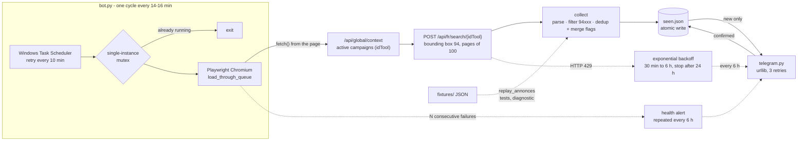

# CROUS Sentinel

Telegram bot that watches the French student-housing site (CROUS) for the Val-de-Marne
département and alerts on every new listing: a real browser to get past the waiting room,
the site's internal JSON API from inside that browser, an atomic memory of what was seen,
and one measured result: **66 days in production, zero listing to report, and a 17-day
outage that the bot announced once and nobody heard.**

[](https://github.com/D-Arslan/crous-sentinel/actions/workflows/ci.yml)

The bot is the pretext; the subject is what it takes for a small unattended process to be
trusted with something that matters, and what happens when the silence of a healthy system
and the silence of a broken one look the same. The full account is in
[docs/POSTMORTEM.md](docs/POSTMORTEM.md).

## Problem → Result

CROUS listings disappear within minutes, and the site defends itself with a waiting room
and an anti-bot layer that serves a "too many visitors" page to plain HTTP clients. The bot
drives Chromium through the queue, then calls the site's search API from the page itself, and
sends a Telegram message for each listing not seen before.

<picture>
  <source media="(prefers-color-scheme: dark)" srcset="docs/telegram-preview-dark.png">
  
</picture>

*Mock-up of the notification format, rendered from
[docs/telegram-preview.html](docs/telegram-preview.html) with invented listings. No real
notification was ever sent, see below.*

**The run.** Figures counted in `bot.log` (not versioned) on 2026-09-20. One process ran from
2026-07-09 10:55 to 2026-09-13 13:24: 66 days, about 21 of them awake (the laptop slept the
rest), 7 exceptions absorbed without a crash, 970 duplicate launches stopped by the
single-instance lock. **Zero listing was ever notified**: every successful cycle reported 0
listings inside the Val-de-Marne box, the memory file stayed empty, and a replay on real data
captured on 2026-09-18 found the same.

| measure | value |
|---|---|
| period covered by the log | 2026-07-08 → 2026-09-16 |
| successful cycles | 7 467 |
| failed cycles (queue, network, outage) | 1 735 |
| last successful cycle | 2026-08-26 14:30 |
| exceptions absorbed, crashes | 7, 0 |
| duplicate launches stopped by the lock | 970 |
| listings notified | 0 |

Source: `bot.log` and `bot.log.old`, 6 MB, kept locally; each row is a line count on those files.

**The incident.** From 2026-08-27 the site stopped serving the bot (queue page never cleared,
then connection timeouts). The bot sent one health alert that evening, then failed 505 cycles
in a row; the alert was never repeated and nobody acted on it until a manual check on
2026-09-13. A test restart on 2026-09-16 met HTTP 429 on every request, home page included.
**The bot has been stopped since then**, scheduled task disabled, by decision: the site
refuses automated clients and the author chose not to evade that.

## Architecture



Static copy: [docs/architecture.svg](docs/architecture.svg). Current code; the operation
figures above were measured at 150–180 s per cycle, before the rework of 2026-09-16. The
point of the shape: every network call leaves **from the page** (the browser is the only
client the site lets through), a listing is written to memory **only after Telegram confirmed**
the send, and the same `collect` function is fed either by the live API or by JSON fixtures,
so the whole chain is testable with the site unreachable.

## Stack

| layer | tools |
|---|---|
| runtime | Python 3.12, one dependency: Playwright 1.61 (Chromium) |
| site access | headless Chromium, `fetch()` evaluated in the page, JSON search API, bounding box + postal-code filter |
| memory | `seen.json`, written through a temporary file and `os.replace` |
| notifications | Telegram Bot API over `urllib` (standard library), 3 attempts |
| operations | Windows Task Scheduler (logon + every 10 min), Windows mutex, log rotated per cycle |
| quality | `unittest` (49 offline tests, replay on captured data), GitHub Actions on Ubuntu and Windows |

## Getting started in 3 commands

```bash
git clone https://github.com/D-Arslan/crous-sentinel.git && cd crous-sentinel && python -m venv .venv
.venv/Scripts/python -m pip install -r requirements.txt && .venv/Scripts/python -m unittest discover -s tests -t .
.venv/Scripts/python scripts/diagnostic.py --rejeu fixtures/real   # full chain on real data, no network
```

What you get, honestly: the tests and the replay work anywhere and need no browser. The
replay prints the listings found in the capture of 2026-09-18 (24 across France, 0 in
Val-de-Marne) and the 3 control towns checked against screenshots of the site.

**Running the bot itself is currently not possible from an automated client**: the site
answers HTTP 429 to headless Chromium within seconds, and the author decided not to disguise
the browser. If that changes, the sequence is:

```powershell
.venv\Scripts\python -m playwright install chromium
copy .env.example .env             # TELEGRAM_TOKEN from @BotFather, TELEGRAM_CHAT_ID
.venv\Scripts\python scripts\telegram_smoke.py   # sends one real test message
.venv\Scripts\python bot.py        # foreground; or install_task.ps1 for the scheduled task
```

`install_task.ps1` registers a task that starts at logon and retries every 10 minutes; the
mutex in `bot.py` makes the retry harmless. `uninstall_task.ps1` removes it.

## Repository layout

```
crous-sentinel/
├── bot.py                   # main loop: cadence, backoff, health alerts, automatic stop, lock
├── crous.py                 # queue, browser-side fetch, context, paginated search, parse, filter, replay
├── store.py                 # seen.json: tolerant load, atomic save
├── telegram.py              # send_message (returns True only on confirmed delivery), formatting
├── tests/                   # 49 unittest cases, no network: chain replay, store, mocked cycle, log rotation
├── fixtures/                # synthetic (root, pagination/) and real/ (campaign 47, HAR of 2026-09-18)
├── scripts/                 # diagnostic --rejeu, fixture capture / HAR extraction, check_*, telegram_smoke
├── install_task.ps1 / uninstall_task.ps1   # Windows scheduled task
├── docs/                    # DESIGN.md, POSTMORTEM.md, architecture.svg, notification mock-up
└── .github/workflows/ci.yml # unittest on ubuntu-latest and windows-latest
```

## Design decisions and trade-offs

- **A real browser, then the API from inside it.** Plain HTTP gets the waiting room; HTML
  scraping breaks on every redesign. `page.evaluate(fetch)` gets structured JSON with the
  browser's own session. The first version used Playwright's Node-side client instead, and
  that was a bug, not a nuance.
- **Failure is never "0 listings".** The search returns `ok`, `rate_limited` or `fail`; only
  `ok` may update memory or conclude anything.
- **Seen only after sent.** A listing enters `seen.json` when Telegram has confirmed the
  message, so a Telegram outage delays a notification instead of losing it.
- **Alerts repeat, and count only when delivered.** After 5 failed cycles, one message, then
  one every 6 hours for as long as it lasts. The one-shot alert is the root cause in the
  post-mortem.
- **429 is an instruction.** Exponential backoff from 30 minutes to a 6-hour cap, and the bot
  stops itself after 24 hours of continuous limiting: a watcher that cannot see should not keep
  knocking on a door that also serves its owner.
- **One `collect` for live and replay.** The parse-filter-dedup path is a pure function fed
  by either the API or fixtures, so the tests exercise the real code path, not a copy.
- **No stealth.** No User-Agent spoofing, no `navigator.webdriver` patch, no proxies. The
  bot is blocked as a bot, and stays blocked.

Details, and the reasoning behind each: [docs/DESIGN.md](docs/DESIGN.md).

## Limits and next steps

- **Stopped.** The site refuses headless Chromium; the bot has not run since 2026-09-16 and
  will not until that changes on the site's side. Everything else here is verifiable offline.
- **Never proved on a real listing.** The notification path was exercised by tests and by the
  startup message, never by an actual Val-de-Marne listing, because there was none.
- **Windows-only operations.** Mutex, `pythonw.exe`, Task Scheduler; the code itself runs
  elsewhere (CI on Ubuntu). Runs only while the user session is open.
- **Pagination guard, not proof**: at most 20 pages of 100 per campaign; beyond that the log
  says so and the results are truncated. Never reached (the box never held more than 0).
- **Telegram is the single channel.** No fallback if the bot token or the chat is gone;
  the startup and health messages are the only proof of life.

## Author

Arslan Dif, M2 distributed systems and data science. Personal project, not affiliated with
CROUS or CNOUS. Related work: [UrbanFlow](https://github.com/D-Arslan/UrbanFlow) (real-time
Vélib' pipeline, Kafka / Spark / XGBoost), [TerraOps](https://github.com/D-Arslan/terraops)
(MLOps platform with a measured drift monitor), [TerraOps Copilot](https://github.com/D-Arslan/terraops-copilot)
(LLM agent with tools, evaluated against ground truth). License: [MIT](LICENSE).
