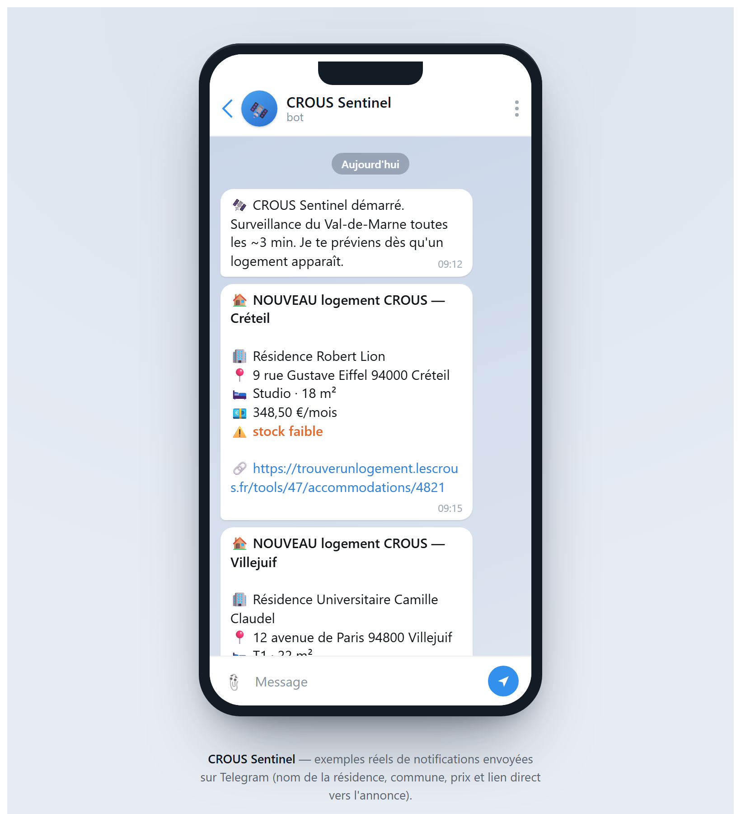

<h1 align="center">🛰️ CROUS Sentinel</h1>

<p align="center">
  <b>Real-time Telegram alerts for CROUS student housing in Val-de-Marne (France).</b><br>
  Listings vanish in minutes — this bot stands guard and pings you the moment one appears.
</p>

<p align="center">
  
  
  
  
  
  
</p>

---

## 📸 Preview

<p align="center">
  
</p>

<p align="center"><i>Real notifications: residence name, town, price and a direct link to the listing.</i></p>

> _(Save a screenshot of the live mockup — `docs/telegram-preview.html` — as `docs/telegram-preview.png` to display it here.)_

---

## Why

CROUS student housing is in **very high demand** and listings **disappear within
minutes**. The official website (`trouverunlogement.lescrous.fr`) also guards itself
with:

- a **waiting room** ("Vous êtes trop nombreux !") under heavy traffic, and
- **anti-bot protection** — a plain HTTP request just gets the waiting-room page.

Refreshing the site by hand, day and night, isn't realistic. **CROUS Sentinel does
it for you.**

---

## ✨ Features

- 🛰️ **Monitors the whole Val-de-Marne (94)** — every town (Ivry, Créteil, Villejuif,
  Vitry, Saint-Maur…), filtered precisely by postal code.
- 🧭 **Beats the waiting room** by driving a real Chromium browser (Playwright), then
  calling the site's **internal JSON API** for clean, structured data.
- 🔔 **Telegram notifications** with residence name, town, price and a **direct link**.
- 🧠 **Notifies new listings only** — persistent memory with atomic, corruption-proof
  writes.
- 🛡️ **Never crashes, never misses, no duplicates** — see the reliability section.
- ⚙️ **Always-on** — one command installs a Windows scheduled task (auto-start,
  auto-restart, windowless).

---

## 🏗️ Architecture

```
┌──────────────┐   every ~3 min         ┌────────────────────────┐
│    bot.py    │ ─────────────────────► │  Playwright (Chromium) │
│ (main loop)  │                        │  clears the waiting room│
└──────┬───────┘                        └───────────┬────────────┘
       │                                            │ internal JSON API
       │                                            ▼
       │                               POST /api/fr/search/{idTool}
       │        ┌───────────────┐                   ▼
       │        │  store.py     │◄──── filter 94xxx + parse
       │        │  seen.json    │      (name, price, town, link)
       │        └───────┬───────┘
       │  new only      ▼
       ▼           ┌────────────────┐
┌──────────────┐   │  📱 Telegram   │
│ telegram.py  │──►└────────────────┘
└──────────────┘
```

**Key idea:** don't scrape HTML (fragile). Drive a real browser to clear the waiting
room, then call the website's **undocumented internal API** from inside that browser
session — robustness of a browser, cleanliness of a JSON API.

---

## 🚀 Quick start

```powershell
# 1. Virtual environment
python -m venv .venv

# 2. Install Playwright + Chromium
.\.venv\Scripts\python.exe -m pip install playwright
.\.venv\Scripts\python.exe -m playwright install chromium

# 3. Secrets — copy the template and fill it in
copy .env.example .env
#   TELEGRAM_TOKEN=...    (from @BotFather)
#   TELEGRAM_CHAT_ID=...  (your chat id, e.g. via @userinfobot)

# 4. Run
.\.venv\Scripts\python.exe bot.py
```

Enable **always-on** (auto-start on logon, auto-restart, windowless):

```powershell
powershell -ExecutionPolicy Bypass -File .\install_task.ps1
```

<details>
<summary>Managing the scheduled task</summary>

```powershell
Get-Content .\bot.log -Wait -Tail 20            # live logs
Get-ScheduledTask -TaskName CrousSentinel       # status
Disable-ScheduledTask -TaskName CrousSentinel   # pause
Enable-ScheduledTask  -TaskName CrousSentinel   # resume
powershell -ExecutionPolicy Bypass -File .\uninstall_task.ps1   # remove
```
</details>

---

## 🛡️ Reliability by design

| Guarantee | How |
|---|---|
| **Never crashes** | Every cycle wrapped in `try/except`; errors are logged, the loop continues |
| **Never misses a listing** | A listing is marked "seen" only **after** a successful notification (retried otherwise) |
| **No duplicates** | Persistent memory keyed by listing id, **atomic** file writes |
| **Survives the waiting room** | Real browser + detect / wait / retry |
| **Failure ≠ empty result** | The search returns an explicit `ok` status — no misleading silence |
| **Warns if blind** | Telegram alert after 5 consecutive failed checks |

✅ Validated with **deterministic tests** (multiple cycles, a Telegram outage, a
corrupt memory file): **12/12 checks passed**.

---

## 🧰 Tech stack

**Python 3.12** · **Playwright** (Chromium) · **Telegram Bot API** (via stdlib
`urllib`) · **JSON** persistence · **Windows Task Scheduler**. Only one external
dependency: `playwright`.

---

## 🗺️ Roadmap

- ☁️ Cloud deployment (VPS / Raspberry Pi) for 24/7 monitoring
- 🐳 Docker packaging
- 🎛️ Advanced filters (price, type, area)
- 🤖 Interactive Telegram commands (`/status`, `/pause`)
- 📊 Listing-frequency analytics

---

## 📚 Full documentation

- 🇬🇧 [`CLAUDE.en.md`](CLAUDE.en.md) — complete English documentation
- 🇫🇷 [`CLAUDE.md`](CLAUDE.md) — documentation complète (français)

---

## 📝 License

Released under the **MIT License** — see [`LICENSE`](LICENSE).

<sub>Personal project. Not affiliated with CROUS or CNOUS. Use responsibly and
respect the website's terms of service.</sub>
